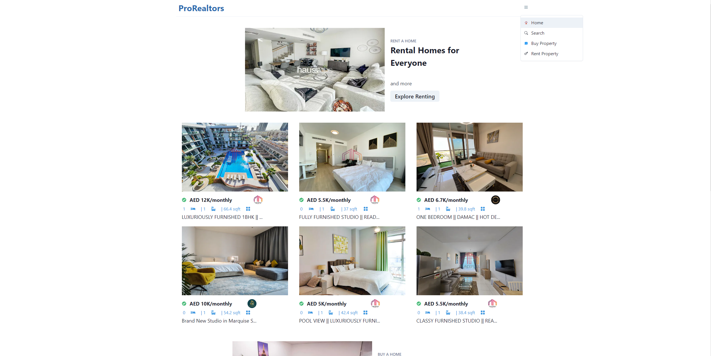

# ProRealtors

A web application for searching for properties in the UAE

## Description

This project was built using React.js and Next.js. I developed this project to improve my front-end skills and learn how to pull from a public API.
I also wanted to learn how to read and work with JSON data that is sent by an API.

### Design

- Create a modern and simple front-end design using React.js
- Routing to different pages using Link from Next.js
- Pulled property data from BayutAPI using Axios
- React components from ChakraUI
- Responsive web design

### Features

- Users can search for different properties through filtering
- Display preview of information for each property such as company and a description
- View detailed property information such as price, bedrooms, bathrooms, square feet, furnishing, amenities, rent or for sale
- Arrow panel of images for each property

## Installation

These instructions will get you a local copy of this project running on your machine for development and testing purposes.

1. Clone this project

2. Install Node.js and npm: https://nodejs.org/en/download

3. Visit https://rapidapi.com/hub and create a free account

4. Subscribe to the api service at https://rapidapi.com/apidojo/api/bayut with the free basic plan

5. In fetchApi.js, replace 'X-RapidAPI-Key' with your own

6. In the project directory, run: `npm install`

7. To start the application, run: `npm run dev`

8. Open it in http://localhost:3000 to view in browser.

## Authors

- [Brandon Tieu](https://github.com/brandontieu626)
